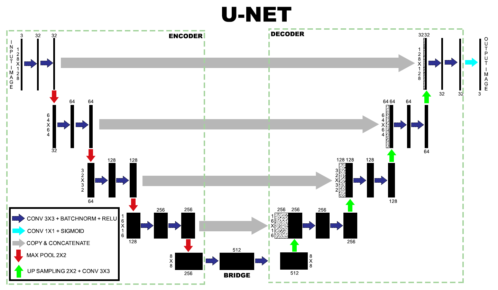
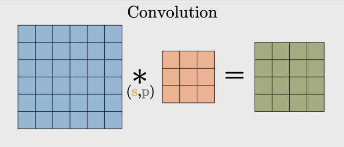
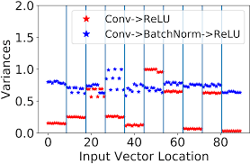
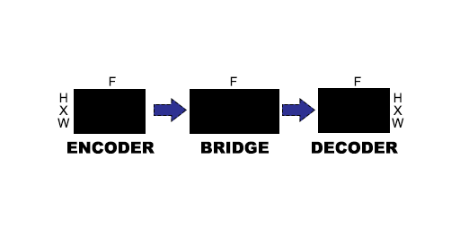

<h1 align="center"> Autoencoder </h1>

<p align="center">
    
    
    
</p>

----

# Pengantar Autoencoder

<p align="center">
    
</p>

Autoencoder adalah jenis jaringan saraf khusus yang dilatih untuk menyalin inputnya ke outputnya. Misalnya, diberikan gambar digit tulisan tangan, autoencoder pertama-tama mengkodekan gambar menjadi representasi laten dimensi yang lebih rendah (downsampling), kemudian menerjemahkan representasi laten kembali ke gambar (upsampling). Autoencoder belajar mengompresi data sambil meminimalkan kesalahan rekonstruksi.

Untuk mempelajari lebih lanjut tentang autoencoder, harap pertimbangkan untuk membaca bab 14 dari [Deep Learning](https://www.deeplearningbook.org/) oleh Ian Goodfellow, Yoshua Bengio, dan Aaron Courville.

# Implementasi Autoencoder

- Image Colorization
  
  Image Colorization adalah teknik rekonstruksi citra yang bertujuan untuk memberikan warna dari gambar abu-abu (grayscale).
  
  Paper: [SCSNet: An Efficient Paradigm for Learning Simultaneously Image Colorization and Super-Resolution](https://aaai-2022.virtualchair.net/poster_aaai528)

<p align="center">
    
</p>

- Image Denoising
  
  Image Denoising adalah teknik rekonstruksi citra yang bertujuan untuk pemulihan gambar bersih dari noise.
  
  Paper: [Generative Adaptive Convolutions for Real-World Noisy Image Denoising](https://aaai-2022.virtualchair.net/poster_aaai4230)

<p align="center">
    
</p>

- Image Compression
  
  Image Compression adalah teknik rekonstruksi citra yang bertujuan untuk meminimalisasi jumlah bit yang merepresentasikan suatu citra sehingga ukuran data citra menjadi lebih kecil.
  
  Paper: [Towards End-to-End Image Compression and Analysis with Transformers](https://arxiv.org/abs/2112.09300)

<p align="center">
    
</p>

- Super Resolution
  
  Super Resolution adalah teknik rekonstruksi citra yang mampu membangkitkan citra beresolusi tinggi dari sebuah citra beresolusi rendah.
  
  Paper: [SCSNet: An Efficient Paradigm for Learning Simultaneously Image Colorization and Super-Resolution](https://aaai-2022.virtualchair.net/poster_aaai528)

<p align="center">
    
</p>

- Shadow Removal 
  
  Shadow Removal adalah teknik rekonstruksi citra yang bertujuan untuk mendeteksi dan menghilangkan bayangan yang dihasilkan oleh sumber cahaya yang terhalang.
  
  Paper: [Efficient Model-Driven Network for Shadow Removal](https://aaai-2022.virtualchair.net/poster_aaai196)

<p align="center">
    
</p>

# Arsitektur Autoencoder (U-Net)

<p align="center">
    
</p>

UNET adalah arsitektur jaringan encoder-decoder berbentuk U, yang terdiri dari empat blok encoder dan empat blok decoder yang dihubungkan melalui sebuah jembatan (bridge).

1. Encoder
   
   Jaringan encoder menerapkan blok konvolusi diikuti dengan downsampling (memperkecil dimensi) dengan maxpool. Jaringan encoder terdiri dari beberapa layer sebagai berikut.
   
   - Convolution layer adalah proses konvolusi citra input dengan filter yang menghasilkan `feature map`.
   
     <p align="center">
        
     </p>
     <p align="center">
        
        
     </p>
     <p align="center">
        
        
     </p>
     
     ```python
     tf.keras.layers.Conv2D(num_filters, kernel_size, strides, padding)
     ```
     
     - num-filters → jumlah filter output dalam konvolusi → dimensi ruang output
     - kernel_size → ukuran spasial dari filter (lebar/tinggi)
     - stride → besar pergeseran filter dalam konvolusi
     - padding → jumlah penambahan nol pada gambar
        - valid → tidak ada padding
        - same → padding nol merata kiri/kanan/atas/bawah
    
   - Batch Normalization berperan untuk mengurangi pergeseran kovarian atau menyamakan distribusi setiap nilai input yang selalau berubah karena perubahan pada layer sebelumnya selama proses training.

     <p align="center">
         
     </p>

     ```python
     tf.keras.layers.BatchNormalization()
     ```
     
   - Pooling layer berperan untuk memperkecil dimensi feature image (downsampling) dan menyimpan informasi penting.
     
     <p align="center">
        
        
     </p>

     ```python
     tf.keras.layers.MaxPool2D(
        pool_size=(2, 2),
        strides=None,
        padding='valid',
     )
     ```
     - pool_size → ukuran pool
     - strides → besar pergeseran
     - padding → jumlah penambahan nol pada gambar
        - valid → tidak ada padding
        - same → padding nol merata kiri/kanan/atas/bawah
     
   - Fungsi aktivasi merupakan fungsi yang digunakan pada jaringan saraf untuk mengaktifkan atau tidak mengaktifkan neuron. Karakteristik yang harus dimiliki oleh fungsi aktivasi jaringan backpropagation antara lain harus kontinyu, terdiferensialkan, dan tidak menurun secara monotonis (monotonically non-decreasing).
     <p align="center">
        
     </p>
   
     ```python
     tf.keras.layers.Activation(activation)
     ```
     
     - activation → fungsi aktivasi 
      
   Sebelum jaringan encoder, perlu melakukan input layer. Ukuran input sesuai dengan jumlah fitur pada data input.
   
   ```python
   tf.keras.layers.InputLayer(input_shape=(height, width, color_channels))
   ```
   - input_shape → input gambar
   
   Dibawah ini merupakan blok encoder.
   
   ```python
   def encoder_block(input, num_filters):
      x = tf.keras.layers.Conv2D(num_filters, 3, padding='same')(input)
      x = tf.keras.layers.BatchNormalization()(x)
      x = tf.keras.layers.Activation('relu')(x)

      x = tf.keras.layers.Conv2D(num_filters, 3, padding='same')(x)
      x = tf.keras.layers.BatchNormalization()(x)
      x = tf.keras.layers.Activation('relu')(x)

      p = tf.keras.layers.MaxPool2D(2, 2)(x)

      return x, p
   ```
   

2. Bridge
   <p align="center">
        
   </p>

   Bridge menghubungkan encoder dan jaringan decoder dan melengkapi aliran informasi.
   
   Dibawah ini merupakan bridge.
   
   ```python
   def conv_block(input, num_filters):
      x = tf.keras.layers.Conv2D(num_filters, 3, padding='same')(input)
      x = tf.keras.layers.layers.BatchNormalization()(x)
      x = tf.keras.layers.layers.Activation('relu')(x)

      return x
   ```

3. Decoder

   Jaringan Decoder berfungsi untuk secara semantik memproyeksikan fitu diskriminatif (resolusi lebih rendah) yang dipekajari oleh jaringan encoder ke ruang piksel (resolusi lebih tinggi) untuk mendapatkan klasifikasi yang padat. Jaringan Decoder terdiri dari beberapa layer sebagai berikut.
   
   - Conv2DTranspose berperan untuk upsampling (menambah dimensi) dan menerapkan blok konvolusi.
     
     <p align="center">
        
     </p>
     <p align="center">
        
        
     </p>
     <p align="center">
        
        
     </p>
     
     ```python
     tf.keras.layers.Conv2DTranspose(num_filters, kernel_size, strides, padding)
     ```
     - num-filters → jumlah filter output dalam konvolusi → dimensi ruang output
     - kernel_size → ukuran spasial dari filter (lebar/tinggi)
     - stride → besar pergeseran filter dalam konvolusi
     - padding → jumlah penambahan nol pada gambar
        - valid → tidak ada padding
        - same → padding nol merata kiri/kanan/atas/bawah
     
   - Concatenate berperan menggabungkan 2 array (tensor).
     
     ```python
     tf.keras.layers.Concatenate()([skip_features, upconv])
     ```
     
     - skip_features → koneksi jalan pintas yang memberikan informasi tambahan yang membantu dekoder menghasilkan fitur output yang lebih baik. 
     - upconv → berupa Conv2DTranspose

   Dibawah ini merupakan blok decoder.
   
   ```python
   def decoder_block(input, skip_features, num_filters):
      upconv = layers.Conv2DTranspose(num_filters, 3, strides=(2, 2), padding="same")(input)
      upconv = layers.BatchNormalization()(upconv)
      upconv = layers.Activation('relu')(upconv)

      c = layers.Concatenate()([skip_features, upconv])

      y = layers.Conv2D(num_filters, 3, padding='same')(c)
      y = layers.BatchNormalization()(y)
      y = layers.Activation('relu')(y)
      
      y = layers.Conv2D(num_filters, 3, padding='same')(y)
      y = layers.BatchNormalization()(y)
      y = layers.Activation('relu')(y)

      return y
   ```

4. Output

   <p align="center">
    
   </p>
   
   Output dari decoder terakhir melewati konvolusi 1x1 dengan aktivasi sigmoid. Fungsi aktivasi sigmoid mewakili klasifikasi berdasarkan piksel. Data yang kita miliki mempunyai rentang dari 0 sampai 1 (sudah ternomalisasi), activation function menggunakan sigmoid yang mempunyai rentang dari 0 sampai 1.
   
   ```python
   tf.keras.layers.Conv2D(3, 1, activation='sigmoid', padding='same') # channels RGB (3), kernel_size, activation, padding
   ```

# Evaluasi Model Autoencoder
Pada Autoencoder terdapat beberapa metrik yang dijadikan sebagai parameter dalam evaluasi sebuah model sebagai berikut.

- PSNR (Peak Signal-to-Noise Ratio)
  
  PSNR merupakan parameter kinerja untuk mengetahui seberapa tinggi perbaikan kejernihan citra terhadap noise dalam dB.
  
  ```python
  def psnr(pred, gt):
    return tf.image.psnr(pred, gt, max_val=1.0)
  ```

- SSIM (Structural Similarity)
  
  SSIM merupakan parameter kinerja untuk mengetahui seberapa tinggi tingkat kemiripan struktur antara citra hasil perbikan dengan citra ground-truth.
   ```python
   def ssim(pred, gt):
     return tf.image.ssim(pred, gt, max_val=1.0)
   ```


---

Code:
- https://colab.research.google.com/drive/1_X3bvVTqXenRf-7Uz6lLxc3dOuDmxzd7?usp=sharing

Referensi:
- https://github.com/aayush9753/ColorIt
- https://github.com/ZIYU-DEEP/Awesome-Autoencoders-for-Representation-Learning
- https://medium.com/geekculture/u-net-implementation-from-scratch-using-tensorflow-b4342266e406
- https://github.com/christianversloot/machine-learning-articles/blob/main/how-to-build-a-u-net-for-image-segmentation-with-tensorflow-and-keras.md
- https://idiotdeveloper.com/what-is-unet/
- http://amroamroamro.github.io/mexopencv/opencv/image_similarity_demo.html
- https://www.tensorflow.org/api_docs/python/tf/image/psnr
- https://www.tensorflow.org/api_docs/python/tf/image/ssim
